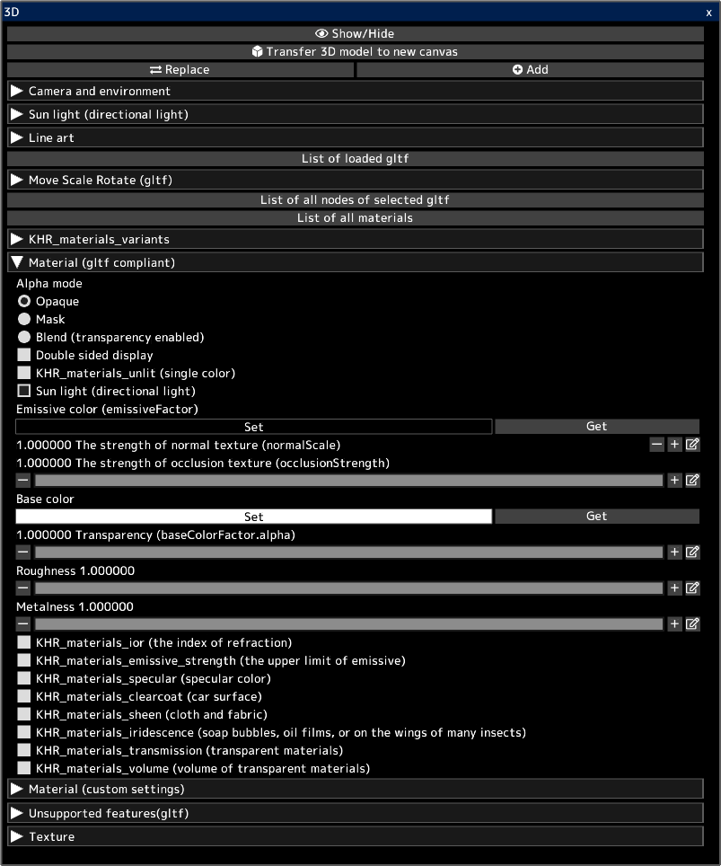

---
hide:
  - toc
---

<!-- https://steamcommunity.com/sharedfiles/filedetails/?id=2964321377 -->

You can open 3D models in gltf and glb files.  
You can transfer the look of 3D to the 2D canvas as it is.  
You can also transfer the line art of 3D to the 2D canvas.  
You can use the transferred canvas to create your illustration. For example, use it as a background for an illustration.

3D models can be created in 3D software such as [blender](https://www.blender.org/) or Autodesk Maya.  
You can also download 3D models from sites like [sketchfab](https://sketchfab.com/).

Clicking the __"Replace"__ button will remove all previously loaded 3D models and leave only the newly loaded 3D model.  
You can add a 3D model by clicking the __"Add"__ button.

You can select one gltf from multiple loaded gltfs by clicking __"List of loaded gltf"__.  
You can move/rotate/scale the selected gltf.

You can select the node (object) in the selected gltf by clicking __"List of all nodes of selected gltf"__.  
You can move/rotate/scale the selected node.

You can select the material in the selected gltf by clicking __"List of all materials"__.  
You can adjust the parameters of the selected material.

The __"Material (gltf compliant)"__ section lists the material parameters according to the gltf specification.  
3D models created with 3D software such as blender are reflected in the parameters in this "Material (gltf compliant)" item.  
[Check this site for saving gltf in blender.](https://docs.blender.org/manual/en/latest/addons/import_export/scene_gltf2.html#gltf-2-0)

3D models downloaded from sites like [sketchfab](https://sketchfab.com/) may look different in sketchfab than in icpaint.  
In that case, enabling KHR_materials_unlit (single color) might give the same look.

* "Sun light (directional light)" is enabled for all materials when loading gltf or glb files. You can uncheck the "Sun light (directional light)" checkbox after importing.
* Point lights and spot lights are not supported (KHR_lights_punctual)
* The animation of 3D models is not supported.
* Lighting by emissiveFactor etc. is not supported.
* It does not support casting shadows for 3D models.
* KHR_draco_mesh_compression, EXT_meshopt_compression, KHR_mesh_quantization are not supported.
* ktx2 (image format) is not supported (KHR_texture_basisu)

[Check this site for how to edit gltf with a text editor.](https://github.com/KhronosGroup/glTF-Tutorials/blob/master/AddingMaterialExtensions/AddingMaterialExtensions_002_UsingVisualStudioCode.md#using-visual-studio-code)

The official descriptions of the parameters in the __"Material (gltf compliant)"__ section are:

* [the specification of gltf](https://registry.khronos.org/glTF/specs/2.0/glTF-2.0.html)
* [description of alpha mode](https://registry.khronos.org/glTF/specs/2.0/glTF-2.0.html#alpha-coverage)
* [description of double sided](https://registry.khronos.org/glTF/specs/2.0/glTF-2.0.html#double-sided)
* [KHR_materials_unlit (single color)](https://github.com/KhronosGroup/glTF/tree/main/extensions/2.0/Khronos/KHR_materials_unlit#khr_materials_unlit)
* [basic description of material](https://github.com/KhronosGroup/glTF-Tutorials/blob/master/gltfTutorial/gltfTutorial_010_Materials.md#materials)
* [KHR_materials_ior (the index of refraction)](https://github.com/KhronosGroup/glTF/tree/main/extensions/2.0/Khronos/KHR_materials_ior#khr_materials_ior)
* [KHR_materials_emissive_strength (the upper limit of emissive)](https://github.com/KhronosGroup/glTF/tree/main/extensions/2.0/Khronos/KHR_materials_emissive_strength#khr_materials_emissive_strength)
* [KHR_materials_specular (specular color)](https://github.com/KhronosGroup/glTF/tree/main/extensions/2.0/Khronos/KHR_materials_specular#khr_materials_specular)
* [KHR_materials_clearcoat (car surface)](https://github.com/KhronosGroup/glTF/tree/main/extensions/2.0/Khronos/KHR_materials_clearcoat#khr_materials_clearcoat)
* [KHR_materials_sheen (cloth and fabric)](https://github.com/KhronosGroup/glTF/tree/main/extensions/2.0/Khronos/KHR_materials_sheen#khr_materials_sheen)
* [KHR_materials_iridescence (soap bubbles, oil films, or on the wings of many insects)](https://github.com/KhronosGroup/glTF/tree/main/extensions/2.0/Khronos/KHR_materials_iridescence#khr_materials_iridescence)
* [KHR_materials_transmission (transparent materials)](https://github.com/KhronosGroup/glTF/tree/main/extensions/2.0/Khronos/KHR_materials_transmission#khr_materials_transmission-)
* [KHR_materials_volume (volume of transparent materials)](https://github.com/KhronosGroup/glTF/tree/main/extensions/2.0/Khronos/KHR_materials_volume#khr_materials_volume)
