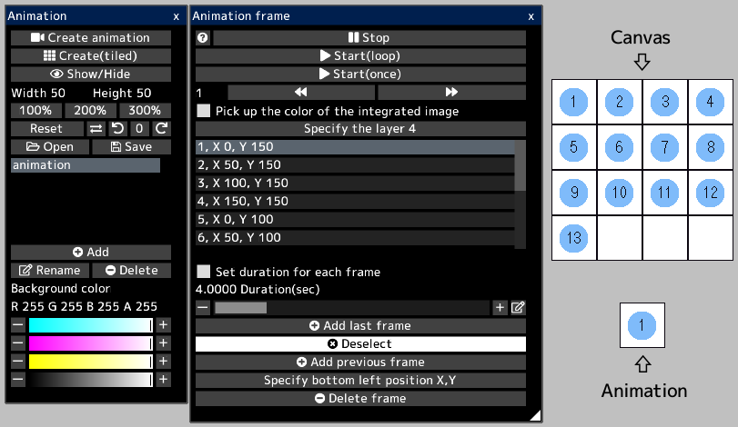
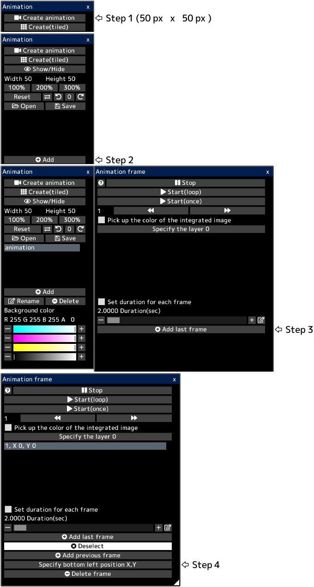
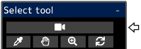

---
hide:
  - toc
---

<!-- https://steamcommunity.com/sharedfiles/filedetails/?id=2963158834 -->

Animation expresses movement by continuously switching images for each frame.

Each frame is some area(rectangle) in the canvas.  
All frames are displayed in the canvas.

When you open an animated gif or webp file, the canvas is created with the animation ready to play.  
However, if the canvas size is too large, animation will not be created.

For example, in this canvas, each frame of the animation is a square area with numbers from 1 to 13.  
When you play the animation, it will play as follows.

### How to create animation

First, create a canvas that looks like this.  
Next, open the "Animation" window by clicking the "Animation Window" button from the "Canvas" menu.

You create 13 frames.

You can specify the bottom left position of each frame.  
__"1, X 0, Y 150"__ means that the bottom left position of the first frame is (0, 150).  
The bottom left position of the canvas is (0, 0).  
In this example, each frame has a width and height of 50 px.  
When a frame is selected, a blue rectangular frame is displayed in the canvas.

If the __"Pick up the color of the integrated image"__ checkbox is checked, the animation will play with the current canvas appearance.  
If this check box is turned off, the animation will be played with only the appearance of the specified layer.

The animation will be played by clicking the __"Play"__ button.  
You can change the position and size of the animation that is played by selecting the animation tool.

You can save the animation as a gif or webp file.  
Since gif files have a limited number of colors, you can save as a gif file only when the pixel art layer is selected.  
In this case, you need to draw the animation in the pixel art layer.
