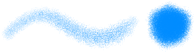

---
hide:
  - toc
---

<!-- https://steamcommunity.com/sharedfiles/filedetails/?id=2966135002 -->

Airbrush

・ Softer  
・ Spacing 0.5  
・ Size 50  
・ Opacity 20%  
・ Min size 100  
・ Min opacity 30%

---

・ Soft  
・ __Spacing 0.1__  
・ Size 8  
・ Opacity 50%  
・ Min size 0  
・ Min opacity 0%

---

・ Hard  
・ __Spacing 2.0__  
・ Size 14  
・ Opacity 100%  
・ Min size 0  
・ Min opacity 100%

---

・ __Brush circle image (star.tga)__  
・ Spacing 2.0  
・ Size 14  
・ Opacity 100%  
・ Min size 0  
・ Min opacity 100%

---

・ Hard  
・ Spacing 2.0  
・ Size 14  
・ Opacity 100%  
・ Min size 0  
・ Min opacity 100%  
・ __Brush base texture (tex.tga)__

---

・ __Brush circle image (star.tga)__  
・ Spacing 2.0  
・ Size 18  
・ Opacity 100%  
・ Min size 0  
・ Min opacity 100%  
・ __Brush base texture (tex.tga)__

---

・ __Brush circle image (img.tga)__  
・ Spacing 1.0  
・ Size 35  
・ Opacity 100%  
・ Min size 40  
・ Min opacity 40%  
・ Random angle 179°

---

・ Softer  
・ Spacing 0.3  
・ Size 20  
・ Opacity 60%  
・ Min size 70  
・ Min opacity 20%  
・ __Brush base texture (tex.tga)__

---

・ Softer  
・ Spacing 0.3  
・ Size 20  
・ Opacity 60%  
・ Min size 70  
・ Min opacity 20%  
・ __Brush base texture (circle.png)__  
・ Scale 30% (Brush base texture)

circle.png

---

・ Hard  
・ Spacing 2.0  
・ Size 18  
・ Opacity 100%  
・ Min size 0  
・ Min opacity 100%  
・ __Ellipse 40%__  
・ Angle 0°

---

・ Hard  
・ Spacing 2.0  
・ Size 18  
・ Opacity 100%  
・ Min size 0  
・ Min opacity 100%  
・ __Ellipse 40%__  
・ __Angle 130°__

---

If the top button of the tool window is "__Marker__", it will be painted in such a way that the colors are replaced.

---

If the top button of the tool window is "__Blur(average color)__", it will be painted with the average color of the drawing inside the brush circle.  
If the "__Pick up the color of the integrated image__" checkbox is checked, the average color is determined based on the current appearance of the canvas.  
If this check box is cleared, the average color is determined based on what is drawn on the current layer.

---

If the top button of the tool window is "__Mixer__",

① Mixed color 70, Extended color 70, Amount of water 10  
② Mixed color 90, Extended color 70, Amount of water 10  
③ Mixed color 90, Extended color 0, Amount of water 10 (paint with one line)  
④ Mixed color 90, Extended color 70, Amount of water 10 (paint with one line)  
⑤ Mixed color 90, Extended color 0, Amount of water 0  
⑥ Mixed color 90, Extended color 0, Amount of water 70

・ Soft  
・ Spacing 0.1  
・ Size 16  
・ Opacity 20%  
・ Min size 50  
・ Min opacity 0%
