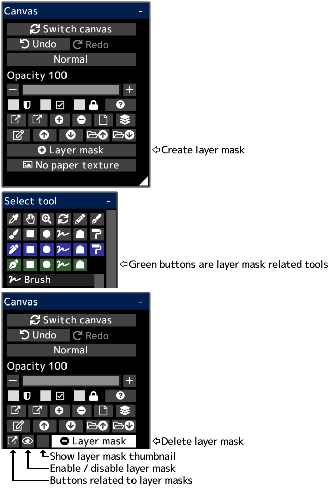

---
hide:
  - toc
---

<!-- https://steamcommunity.com/sharedfiles/filedetails/?id=2953900226 -->

You can partially hide the drawing contents by using a layer mask.  
A layer mask has an opacity (0 ~ 255).  
You can also create a layer mask for the group.  
If you create a layer mask for the adjustment layer, you can adjust the part to be affected by the adjustment layer.
