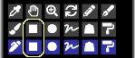
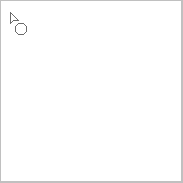
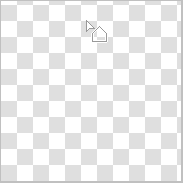

---
hide:
  - toc
---

<!-- https://steamcommunity.com/sharedfiles/filedetails/?id=2967678481 -->

You can select the "Rectangle" tool by clicking the ■ button in the "Select Tool" window.

Example of painting with RGBA (44,134,245,150)

Example of painting with __"Rounded corners"__ checked and set to 60 %

Example of painting with the __"Frame"__ checkbox turned on

If you check the __"Aspect ratio"__ checkbox, you can fix the ratio of the height and width of the rectangle.  
If you check the __"px"__ checkbox, you can specify the height and width of the rectangle in px units.

### "Circle" tool

Example of painting with RGBA (44,134,245,150)

Example of painting with the "Softer" radio button selected

Example of painting with __"Ellipse"__ checked and set to 40

Example of painting with the "Softer" radio button selected

### "Lasso" tool

Example of painting without blurring (RGBA (44,134,245,255))

Example of painting with blur 15x15 px (RGBA (44,134,245,150))

Example of painting with the __"Visualization mode"__ checkbox turned on (blur 3x3 px)

### "Polygon" tool

With the "Polygon" tool, the clicked position becomes the vertex of the polygon.  
You can undo up to one.

---

All of these painting methods can also be painted in __"Blending mode"__.  
For example, you can make it darker by painting with the blending mode "Multiply".  
Also, for example, you can make it brighter by painting it with a whitish yellow in the blending mode "Add(Glow)".
