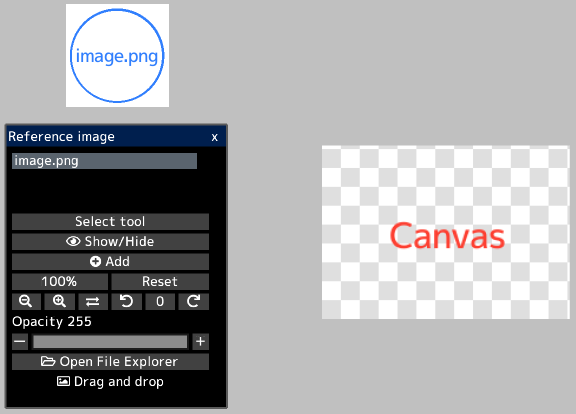
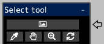

---
hide:
  - toc
---

<!-- https://steamcommunity.com/sharedfiles/filedetails/?id=2966524221 -->

By opening the image in the "Reference image" window, you can display the image separately from the canvas.  
You can use it as a reference when creating illustrations.

You can freely move the reference image by clicking the __"Select tool"__ button.  
You can also select tools for reference images in the "Select tool" window.

