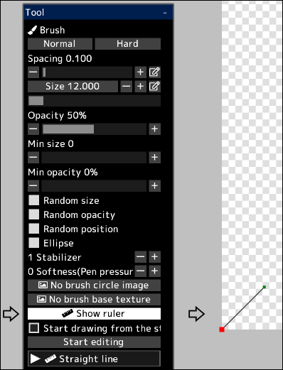

---
hide:
  - toc
---

<!-- https://steamcommunity.com/sharedfiles/filedetails/?id=2969756482 -->

You can draw brush strokes along the ruler.

By clicking the __"Show ruler"__ button, the ruler will be displayed at the lower left position of the canvas.  
This ruler has the same feature as curves in vector layers.  
The red dot in the ruler is the starting point of the ruler.

When the __"Start drawing from the starting point of the ruler (red point)"__ is unchecked, the brush stroke will be from the point of the shortest distance between the position touched with the brush and the ruler.

By clicking the __"Start editing"__ button, you will be able to change the shape of the ruler.

|  | How to use |
| ------ | ----------- |
| Select the control point     | Click the control point |
| Move the control point       | Click and drag the control point |
| Delete the control point     | Alt + click the control point |
| Whether the control point should be sharp or a smooth curve | Ctrl + click the control point |
| Add a control point to the end of the curve     | Click anywhere other than the control point |
| Add a control point in the middle of the curve  | Click anywhere on the curve |
| Add a control point (sharp angle) to the end of the curve | Ctrl + click anywhere other than the control point |
| Add a control point (sharp angle) in the middle of the curve | Ctrl + click anywhere on the curve |
| Move the curve while maintaining curve shape                 | Shift + Alt + click and drag |
| Move multiple control points together | Shift + click and drag to move all control points inside the circle |
| Scale the curve                              | Ctrl + Alt + click and drag left or right |
| Rotate the curve around the clicked position | Ctrl + Shift + Alt + click and drag left or right |

By clicking the __"Finish Editing"__ button, you will be able to draw with the brush again.
