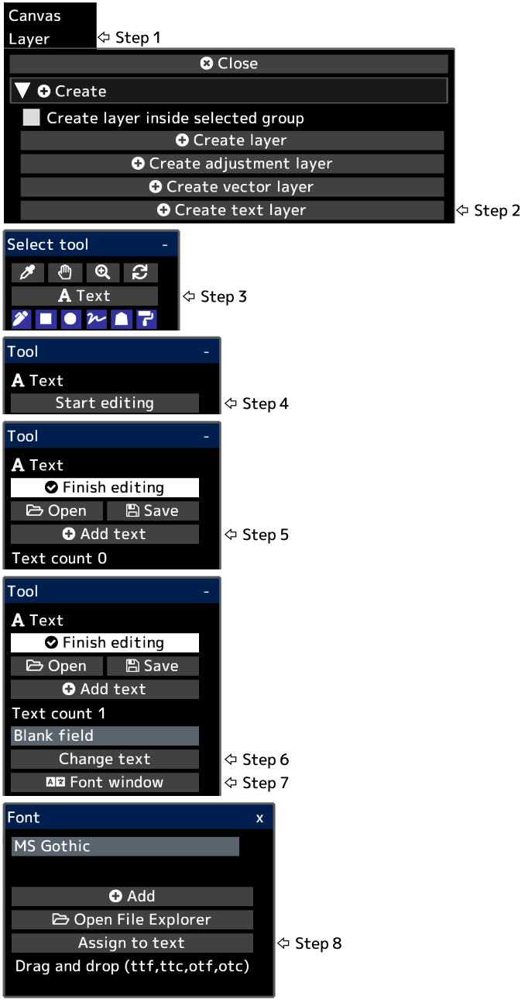

---
hide:
  - toc
---

<!-- https://steamcommunity.com/sharedfiles/filedetails/?id=2954846682 -->

The text is created at the lower left position of the canvas.  
After clicking __"Finish editing"__, layer opacity, blending mode, layer mask, etc. will be applied.

You can convert a text layer to a drawing layer by clicking the __"Rasterize layer"__ button in the "Layer" menu.
