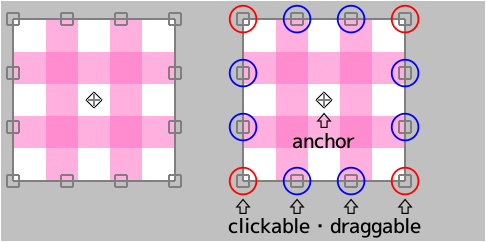
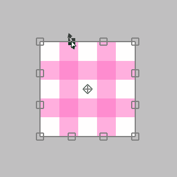

---
hide:
  - toc
---

<!-- https://steamcommunity.com/sharedfiles/filedetails/?id=2955664375 -->

### If the cursor is inside the transformation area

You can move it freely by clicking.

You can move it only horizontally or only vertically by Shift + clicking.

### If the cursor is outside the transformation area

You can rotate it by clicking.

You can rotate it around the anchor by Ctrl + clicking.

### If the cursor is on the anchor

You can move only the anchor by clicking.

### If the cursor is on the top, bottom, left, or right edge ( □ )

You can move the edge by clicking.

You can move both sides at the same time without moving the center position by Alt + clicking.

You can move the edge freely by Ctrl + clicking.

You can move the edge along its direction by Ctrl + Shift + clicking.

### If the cursor is on 4 vertices ( □ )

You can move the vertex by clicking.

You can scale and rotate it with Alt + clicking.

You can scale it uniformly by Shift + clicking.

You can scale it uniformly without moving the center position by Shift + Alt + clicking.

---

You can move only the vertex freely by Ctrl + clicking.  
In this case, the appearance changes in three ways.

#### Ctrl + clicking in "Transform"

#### Ctrl + clicking in "Perspective transform" with "Perspective" turned off

#### Ctrl + clicking in "Perspective transform" with "Perspective" turned on

You can return to the state before transform by pressing the __"Reset"__ button.

* Transform(canvas size)
* Move Scale Rotate(canvas size)
* Perspective transform
* Liquify filter
* Retouch filter

These five methods can save transform contents.  
If saved, you can apply the same transform to another layer.

If you want to transform by specifying a numerical value, please use __"Move Scale Rotate"__.  
For example, if you want to scale it down to 50 % or rotate it by 45 degrees.
