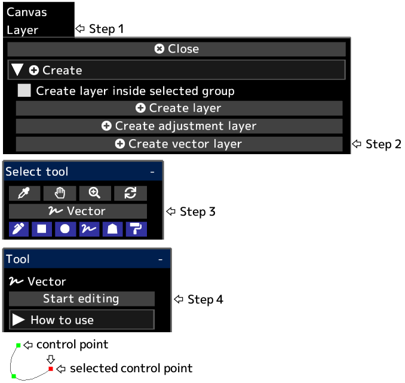

---
hide:
  - toc
---

<!-- https://steamcommunity.com/sharedfiles/filedetails/?id=2955212571 -->

After clicking __"Finish editing"__, layer opacity, blending mode, layer mask, etc. will be applied.

You can convert a vector layer to a drawing layer by clicking the __"Rasterize Layer"__ button in the "Layer" menu.

|  | How to use |
| ------ | ----------- |
| Select the control point | Click the control point |
| Deselect the control point | Alt + click anywhere other than the control point |
| Move the control point | Click and drag the control point |
| Delete the control point | Alt + click the control point |
| Whether the control point should be sharp or a smooth curve | Ctrl + click the control point |
| Add a control point to the end of the curve | Click anywhere other than the control point with the control point selected |
| Add a control point in the middle of the curve | Click anywhere on the curve with the control point selected |
| Add a control point (sharp angle) to the end of the curve | Ctrl + click anywhere other than the control point with the control point selected |
| Add a control point (sharp angle) in the middle of the curve | Ctrl + click anywhere on the curve with the control point selected |
| Create a control point as another curve | Click anywhere other than the control point with no control point selected |
| Create a control point (sharp angle) as another curve | Ctrl + click anywhere other than the control point with no control point selected |
| Delete the curve | Repeat Alt + click on all control points, or click the "Delete curve" button |
| Move the curve while maintaining curve shape | Shift + Alt + click and drag with the control point selected |
| Duplicate the curve | Ctrl + Shift + click and drag with the control point selected |
| Move multiple control points together | Shift + click and drag to move all control points inside the circle |
| Scale the curve | Ctrl + Alt + click and drag left or right |
| Rotate the curve around the clicked position | Ctrl + Shift + Alt + click and drag left or right |
